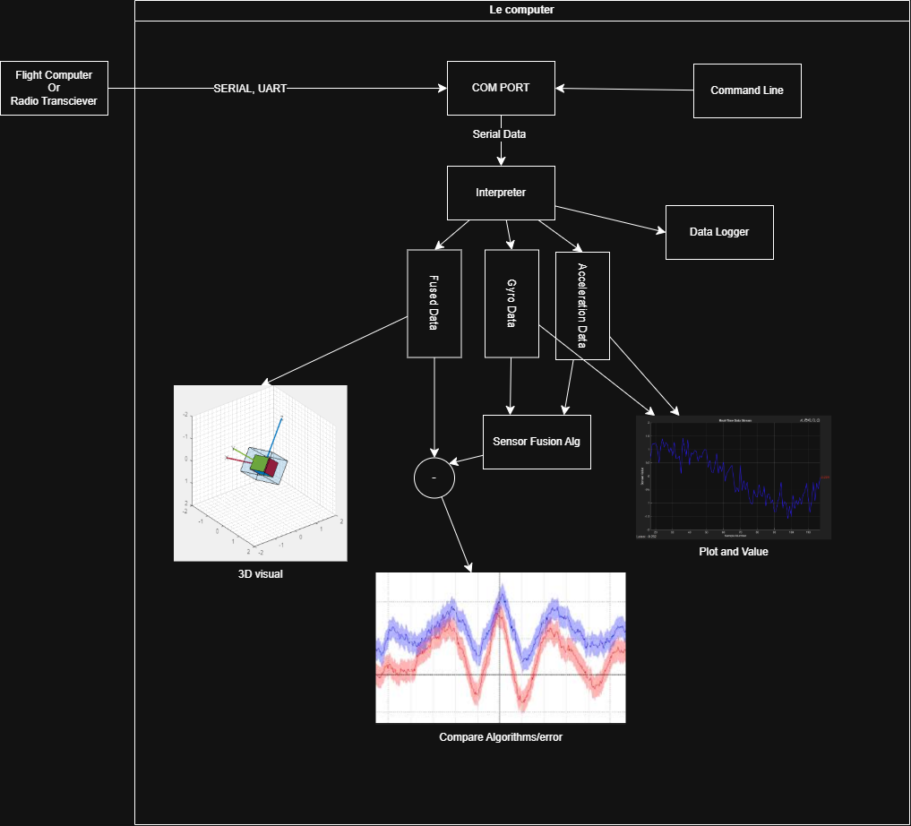
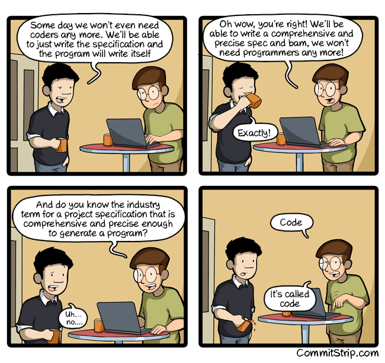
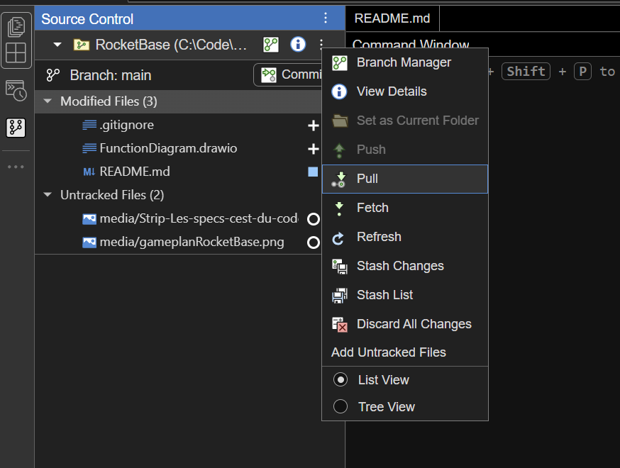
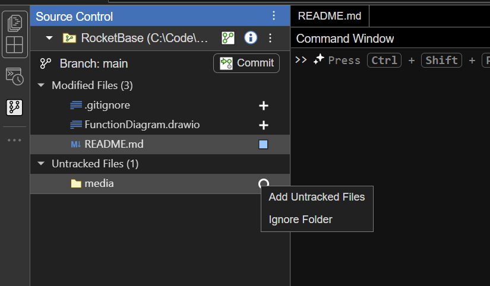

# RocketBase
A base station and debug suite for UTA Aero Mavs

# Structure

# Quickstart
1. [install Git on your operating system](https://git-scm.com/install/)
2. [Install or update to Matlab R2025a](https://www.mathworks.com/downloads/) (If you use a newer version I will kill u)
3. add the source control panel to the leftmost matlab taskbar of the screen by clicking the three dot icon on the left sidebar
4. Click the clone repository button
5. [On the main repo page](https://github.com/UTA-Aeromavs/RocketBase) click the green code button and copy the git URL
6. Paste URL and follow setup Instructions

# Working on and committing to this project
## BEFORE CONTINUING PLEASE READ THE FOLLOWING RULES
1. NO AI GENERATED CODE!!! IF WE WANTED AN AI TO WRITE THE CODE WE WOULD JUST ASK IT OURSELVES.
I. DO. NOT. WANT. TO. MAINTAIN. AI. SLOP. CODE. AI is not a substitute for learning how to code.
2. Do not commit broken code
3. Please document what you do.

**The git workflow**
In programming we use a version control system called git. Git has 5 stages of development. These are:
Sync from remote -> Checkout branch -> Write & Save <-> Take a snapshot -> Push to remote

For people coming from programs like MS Word might at first feel like this system is overly convoluted, but there is method in the madness! 

Unlike regular text, code carries a deep logical meaning defined through order. The problem that git is made to solve is : how do we allow multiple users to make changes simultaniously without resulting in one persons changes destroying another. The solution : maintain a immutable ledger of snapshots, or commits, so to speak. These commits may be returned to at any time, merged together, and shared in local or remote repositories.

If you have followed the [quickstart instructions](#quickstart), then you already completed the first step. There are 2 ways to sync a repository: a clone or a pull. Clone as the name implies clones the repository to your local system like a download, but unlike a download it also copies the version control tree to your local system. If you want to learn more about navigating the version control tree you can read an article about it [here](https://git-scm.com/book/en/v2/Git-Basics-Viewing-the-Commit-History). The other method is a pull which copies the changes from one repository to another. To get started open the source control panel as outlined in the quickstart guide. Then open the git dropdown by pressing the three dots on the right of the changes header and navigate to `...>Pull` (this button may be hidden until you hover over it) This will bring you up to date to the latest version of the repo.

The next thing to move to a different branch. Branches are a sandboxed development enviroment built from a particular commit. Since Commits or immutable, by keeping your work on a branch you ensure that noone's changes can interfere with your development enviroment. Once you are done you then merge those changes back to the main branch.  select the dropdown `...>Branch Manager` and click `New Branch` to create a new branch. 

Your current working branch can be found in the source control panel of matlab. To switch branches, open the branch manager and select the branch you wish to switch to.

Now you write your code. When you want to save changes, save your files as you normally do. If you want to save in a way that you can go back create a new commit by opening the git panel, and pressing the `Commit` button, writing commit changes and finally pressing commit. Remember that if you create a new file that did not exist, you must enable git tracking by opening the Source control panel, expanding the untracked files section, and rightlicking the circle icon and selecting `Add untracked file`

Finally once you are done it is time to upload your changes to the cloud. To do so we will be using a pull, but this time we will be triggering it from the remote repository stored on github. By default you will not have permission to pull on your own, so instead you will submit a pull request, which a team lead can review and resolve any [merge conflicts](https://code.visualstudio.com/docs/sourcecontrol/merge-conflicts). In order to do this, install the GitHub Pull requests extension in VS Code, which will create a new panel on the left side of the screen. Open the panel and press create pull requests button beside the pull requests tab.

Choose the base and the branch you want to merge, give the pull request a title, fill out the description and press create!

And Voila! you now can use git and develop in this repo